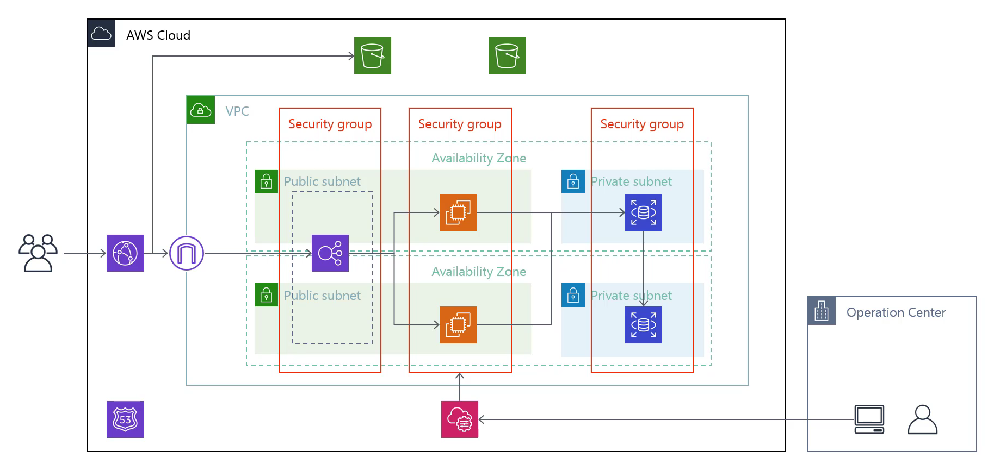

このAWSの構成図は、一般的なクラウドインフラストラクチャの構成を示しており、以下のようなステップで構成されています：

1. **AWS Cloud**：これはAWSのクラウドサービスを示しており、全体のインフラがここに配置されます。

2. **ユーザー**：図の左側にいる人物は、AWSのリソースにアクセスするエンドユーザーを表しています。

3. **インターネットゲートウェイ**：このゲートウェイを通じて、インターネットからVPC（Virtual Private Cloud）内のリソースにアクセスします。

4. **VPC (Virtual Private Cloud)**：VPCは、AWSクラウド内にプライベートなネットワークスペースを提供し、サブネットやセキュリティグループを含むリソースのセットアップに使われます。

5. **サブネット**：VPC内のサブネットが2種類あります。
   - **パブリックサブネット**：外部から直接アクセス可能なサブネットで、通常はウェブサーバーやロードバランサーなどが配置されます。
   - **プライベートサブネット**：外部からの直接アクセスが制限され、データベースやアプリケーションサーバーなどが配置されることが一般的です。

6. **セキュリティグループ**：これらはファイアウォールの役割を果たし、サブネット内の各リソースへのトラフィックを制御します。

7. **EC2インスタンス**：Amazon Elastic Compute Cloud（EC2）インスタンスがサブネット内に配置され、計算リソースを提供します。

8. **ロードバランサー**：パブリックサブネット内のロードバランサーは、トラフィックを複数のサーバー（例えばEC2インスタンス）に分散させ、負荷を均一にします。

9. **RDSインスタンス**：Amazon Relational Database Service（RDS）は、プライベートサブネット内にあり、データベースサービスを提供します。

10. **可用性ゾーン**：VPC内のリソースは複数の可用性ゾーン（AZ）にまたがって配置されており、高可用性と耐障害性を提供します。

11. **S3バケット**：図上部にあるS3アイコンは、Amazon Simple Storage Service（S3）のバケットを表し、データストレージのために使用されます。

12. **AWS Lambda**：Lambdaアイコンは、サーバーレスコンピューティングプラットフォームであるAWS Lambdaを表しており、コードをイベント応答で実行します。

13. **オペレーションセンター**：図の右下に配置されており、インフラの運用監視や管理を行う場所を指している可能性があります。

14. **Route 53**：AWSのDNSサービスであるAmazon Route 53のアイコンが含まれており、ドメイン名システム（DNS）ルーティングやドメイン名登録の機能を提供します。

各コンポーネントはセキュリティとアクセス管理のために適切に構成されており、全体的に冗長性と